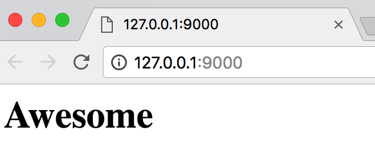

# Awesome

跟随廖雪峰的python3教程实战项目

### day1


> 关于打开网页下载的问题,按照评论解决,如下

```python
-return web.Response(body=b'<h1>Awesome</h1>')
+return web.Response(body=b'<h1>Awesome</h1>',content_type='text/html')
```

### day2

> 第二天跟着网页就跑不起来了,教程源码不一致,好挫败...估计要放弃了!

先继续了解下协程,还有ORM相关的😌,有时间精力再继续